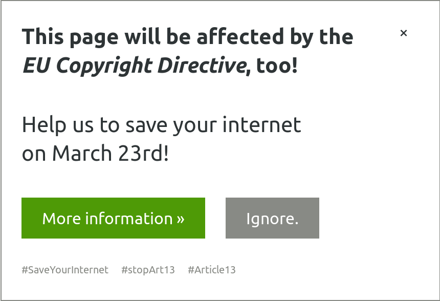

Save Your Internet – Widget
===========================

The planned EU copyright reform constitutes a massive threat to the free exchange of opinions 
and culture online. Together, on March 23rd 2019 “savetheinternet.info” call for a Europe-wide day
of protests against the dangers of the reform.

This widget can be easily placed on your page, blog or website to inform your visitors and readers
about this reform on March 21st. Just use the code below:


Widget
------




Usage
-----

```html
<script>
  const SAVE_YOUR_INTERNET_CONFIG = {
    'language': 'en',
    'hideOnReload': false
  };
</script>
<script src="dist/syi-widget.js" async></script>
```

### Parameters

The following parameters can be used for `SAVE_YOUR_INTERNET_CONFIG`:

| Parameter      | Default value  | Description                                                      |
| -------------- | -------------- | ---------------------------------------------------------------- |
| `language`     | `'en'`         | Language of the widget                                           |
| `hideOnReload` | `false`        | If it set to `true`, widget will be only shown once              |
| `blackOutDay`  | `'2019-03-21'` | Day when widget should be shown (can be overwritten for testing) |


Goals
-----

* Easy to integrate (just one JavaScript file, and no external dependencies/frameworks)
* Easy to configure (`showAlways`, `language`)
* Easy to test (add `#showsaveyourinternet` to the URL)
* Simple design that fits on every page
* Responsive design - so we can show this also on mobile devices easily


Contribute
----------

If you want to add more languages or improve code quality, feel free to submit a Pull Request!
